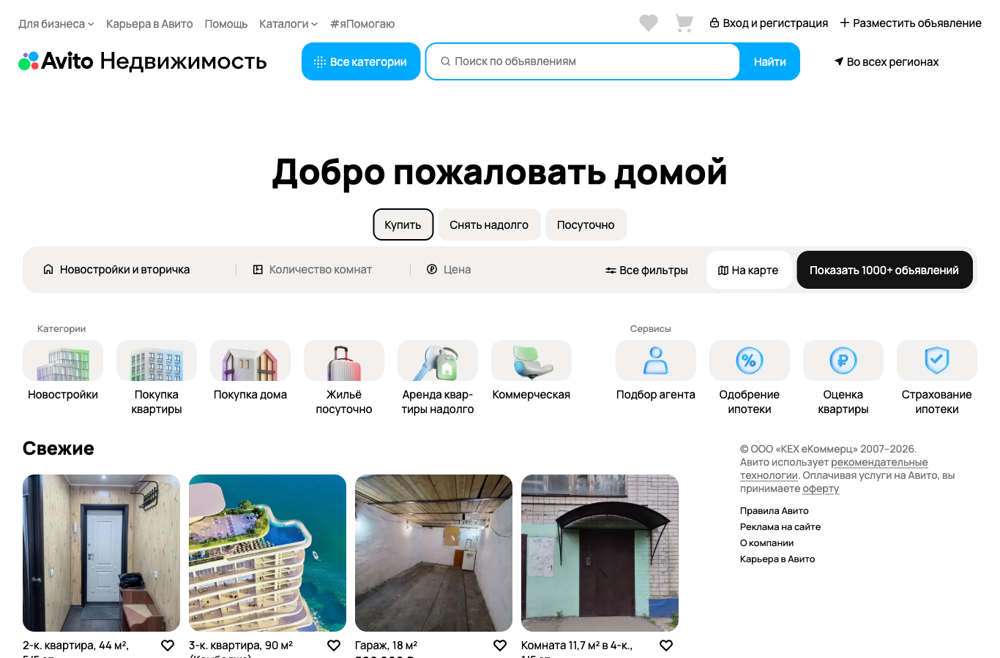

# 1 Описание и анализ предметной области

Предметная область – это часть реального мира, которая подлежит изучению
с целью автоматизации организации управления. Предметной областью
информационной системы является совокупность объектов, свойства которых
и отношения между которыми представляют интерес для пользователей
информационных систем (ИС) [2].

Предметной областью данной работы является рынок недвижимости
Российской Федерации в части онлайн-объявлений о покупке, продаже и
аренде жилья, а также процессы сбора, нормализации, дедупликации и анализа
таких объявлений, получаемых из нескольких независимых источников.

## 1.1 Основные понятия и определения

### 1.1.1 Рынок недвижимости

Недвижимость – вид имущества, признаваемого в законодательном порядке
недвижимым. К недвижимости по происхождению относятся земельные участки,
участки недр и всё, что прочно связано с землёй, то есть объекты,
перемещение которых без несоразмерного ущерба их назначению невозможно,
в том числе здания, сооружения, объекты незавершённого строительства [3].

В рамках настоящей работы рассматриваются следующие сегменты рынка
жилой недвижимости:

- вторичное жильё – квартиры, частные дома и комнаты, ранее
  находившиеся в собственности физических или юридических лиц и
  выставленные на продажу повторно;
- новостройки (первичное жильё) – объекты жилой недвижимости,
  реализуемые застройщиком или его уполномоченным агентом до ввода
  в эксплуатацию или сразу после него;
- долгосрочная аренда – предоставление жилого помещения во временное
  пользование на срок от одного месяца;
- посуточная аренда – предоставление жилого помещения во временное
  пользование на срок от одних суток, как правило с почасовой или
  посуточной тарификацией.

### 1.1.2 Объявление о недвижимости

Объявление о недвижимости – структурированная электронная публикация,
содержащая сведения об объекте недвижимости, условиях сделки и контактах
продавца либо его представителя. Типовая структура объявления приведена
в таблице 1.

Таблица 1 – Типовая структура объявления о недвижимости

| Группа полей   | Атрибуты                                                      |
| -------------- | ------------------------------------------------------------- |
| Идентификация  | идентификатор объявления, источник, URL, дата публикации      |
| Тип сделки     | купля-продажа, долгосрочная аренда, посуточная аренда         |
| Тип объекта    | квартира (вторичка/новострой), дом, комната, студия и т. д.   |
| Адрес          | регион, город, район, улица, дом, координаты                  |
| Характеристики | общая и жилая площадь, число комнат, этаж, год постройки      |
| Цена           | стоимость, валюта, тип (за объект / за м² / за сутки)         |
| Медиа          | фотографии, планировка, видеообзор                            |
| Контакт        | имя, телефон, тип продавца (собственник/агентство/застройщик) |

### 1.1.3 Агрегация данных из разнородных источников

Агрегация данных – процесс сбора, приведения к единой структуре и
объединения сведений, получаемых из нескольких независимых источников,
с целью формирования непротиворечивого представления об исследуемом
объекте [4].

Особенность агрегации в рамках поставленной задачи состоит в том, что
одни и те же объекты недвижимости могут быть одновременно размещены на
нескольких площадках с различающимися ценой, описанием и набором
фотографий, а форматы данных у каждого источника свои.

### 1.1.4 Веб-скрапинг и программные интерфейсы

Веб-скрапинг (от англ. web scraping) – автоматизированное извлечение
данных со страниц веб-сайтов путём разбора их HTML-разметки [5].
Веб-скрапинг применяется, когда источник не предоставляет официального
программного интерфейса (API) или условия его использования не покрывают
требуемый сценарий.

Программный интерфейс приложения (Application Programming Interface,
API) – описанный набор способов, которыми одна компьютерная программа
может взаимодействовать с другой программой [6]. Применение API является
предпочтительным способом получения данных, так как оно обеспечивает
стабильный формат ответа и регулируемую нагрузку на источник.

### 1.1.5 Дедупликация объявлений

Дедупликация – процесс выявления и объединения записей, описывающих
один и тот же объект реального мира, но различающихся по форме
представления [7]. В задаче агрегации объявлений дедупликация необходима,
поскольку один объект недвижимости может быть размещён на нескольких
площадках одновременно, а также публиковаться повторно одним и тем же
собственником.

Признаки, по которым производится сопоставление: координаты или адрес
объекта, общая площадь, число комнат, этаж, перцептивные хеши
фотографий (perceptual hashing) [8].

## 1.2 Обзор систем-аналогов

В настоящее время на российском рынке существует ряд веб-сервисов,
позволяющих публиковать и просматривать объявления о недвижимости, а
также выполнять их поиск и сравнение. Далее рассмотрены пять наиболее
распространённых систем: «Авито Недвижимость», «Циан», «Домклик»,
«Яндекс Недвижимость» и Restate.

### 1.2.1 Авито Недвижимость

«Авито Недвижимость» – раздел одного из крупнейших российских сервисов
объявлений «Авито», посвящённый сделкам с жилой и коммерческой
недвижимостью [9].
Сервис охватывает все регионы Российской Федерации и содержит
значительную по объёму базу объявлений как от частных лиц, так и от
профессиональных участников рынка.

К достоинствам данной системы относятся:

- обширная база объявлений по жилой и коммерческой недвижимости,
  охватывающая все регионы Российской Федерации;
- высокая доля объявлений от частных продавцов по сравнению с другими
  рассмотренными сервисами;
- поддержка всех типов сделок – купли-продажи вторичного жилья и
  новостроек, долгосрочной и посуточной аренды;
- развитый поиск на карте с геофильтрами и отображением плотности
  предложения по районам.

К недостаткам данной системы относятся:

- высокая доля неактуальных и дублирующих объявлений, обусловленная
  массовостью платформы и низким порогом модерации;
- доступ к программному интерфейсу предоставляется только
  зарегистрированным профессиональным участникам платформы;
- агрессивная защита от автоматического сбора данных, включающая
  проверки CAPTCHA и ограничения частоты запросов;
- неравномерное качество описаний объектов из-за преобладания частных
  публикаций.

На рисунке 1 представлена главная страница раздела «Авито Недвижимость».

### 1.2.2 Циан

«Циан» (ЦИАН, cian.ru) – специализированный сервис объявлений о
недвижимости, существующий с 2001 года [10]. Позиционируется как
платформа преимущественно для профессиональных участников рынка:
агентств, застройщиков и риелторов.

К достоинствам данной системы относятся:

- узкоспециализированный сервис недвижимости с высоким качеством
  модерации и низкой долей неактуальных объявлений;
- встроенная аналитика рынка: история изменения цен, индексы и
  статистика по районам;
- стандартизованная структура карточек объявлений, упрощающая
  нормализацию данных;
- наличие профессионального API и поддержка XML-фидов для интеграции
  с CRM-системами.

К недостаткам данной системы относятся:

- доступ к программному интерфейсу предоставляется только
  зарегистрированным профессиональным участникам и требует оформления
  платного тарифа;
- относительно высокая стоимость размещения для профессиональных
  участников, уменьшающая долю частных объявлений;
- более узкая по сравнению с «Авито» аудитория в сегменте частных
  покупателей.

На рисунке 2 представлена главная страница сервиса «Циан».

### 1.2.3 Домклик

«Домклик» (domclick.ru) – запущенный в 2016 году сервис ПАО «Сбербанк»,
объединяющий объявления о недвижимости и услуги по ипотечному
кредитованию [11]. На площадке размещаются объявления от частных лиц,
агентств недвижимости и застройщиков; платформа предоставляет
инструменты оформления ипотеки и юридической проверки объектов.

К достоинствам данной системы относятся:

- глубокая интеграция с ипотечными продуктами ПАО «Сбербанк»,
  охватывающая оформление и электронную регистрацию сделки;
- сервис юридической проверки объектов с гарантией возмещения,
  снижающий риск покупателя;
- поддержка всех типов сделок, включая посуточную аренду через
  интеграцию с сервисом «Суточно.ру»;
- наличие базовой аналитики по рынку, в том числе по сегменту
  ипотечного кредитования.

К недостаткам данной системы относятся:

- ориентация интерфейса преимущественно на клиентов «Сбербанка»;
- меньшая по сравнению с «Авито» и «Циан» доля объявлений от частных
  лиц;
- программный интерфейс доступен только агентствам и застройщикам на
  основании договора с платформой.

На рисунке 3 представлен интерфейс сервиса «Домклик».

### 1.2.4 Яндекс Недвижимость

«Яндекс Недвижимость» (realty.yandex.ru) – сервис объявлений,
входящий в экосистему компании «Яндекс» [12]. Интегрирован с картами,
сервисом ипотечного калькулятора и другими продуктами экосистемы.

К достоинствам данной системы относятся:

- глубокая интеграция с «Яндекс Картами» и инфраструктурными слоями –
  школами, детскими садами и транспортной доступностью;
- система верификации объявлений от застройщиков, снижающая долю
  недостоверных предложений;
- встроенные аналитические инструменты: тепловые карты цен по районам
  и индексы стоимости жилья;
- наличие смежного сервиса «Яндекс Аренда» с юридическим
  сопровождением сделок долгосрочной аренды;
- единый профиль пользователя экосистемы «Яндекс», упрощающий работу
  с сервисом.

К недостаткам данной системы относятся:

- меньшая по сравнению с «Авито» и «Циан» база объявлений от частных
  лиц;
- программный интерфейс закрыт для сторонних разработчиков и
  используется только внутри экосистемы «Яндекс».

На рисунке 4 представлен интерфейс «Яндекс Недвижимости».

### 1.2.5 Restate

Restate (restate.ru) – витрина недвижимости, ориентированная
преимущественно на профессиональных участников рынка – агентств,
брокеров и застройщиков [13]. Объявления публикуются зарегистрированными
пользователями через личный кабинет и проходят модерацию.

К достоинствам данной системы относятся:

- высокая доля объявлений от профессиональных участников рынка –
  агентств, брокеров и застройщиков;
- обязательная ручная модерация всех объявлений, снижающая долю
  дублей и недостоверных предложений;
- развитые аналитические разделы: индексы цен и графики динамики
  рынка.

К недостаткам данной системы относятся:

- меньшая по сравнению с «Авито», «Циан» и «Домклик» общая база
  объявлений и пользовательская аудитория;
- отсутствие автоматического сбора и сопоставления объявлений с
  других крупных площадок;
- низкая доля частных продавцов из-за ориентации на профессиональных
  участников.

На рисунке 5 представлена главная страница сервиса Restate.

Результаты сравнительного анализа рассмотренных систем по ключевым
для настоящей работы критериям приведены в таблице 2.

Таблица 2 – Сравнение систем-аналогов

| Критерий                                                           | Авито | Циан | Домклик | Яндекс | Restate |
| ------------------------------------------------------------------ | :---: | :--: | :-----: | :----: | :-----: |
| Высокая доля объявлений от частных лиц                             |   +   |  −   |    −    |   −    |    −    |
| Строгая модерация и низкая доля дублирующих объявлений             |   −   |  +   |    +    |   +    |    +    |
| Развитая аналитика рынка (индексы и графики динамики цен)          |   −   |  +   |    ±    |   +    |    +    |
| Публичный программный интерфейс для сторонних разработчиков        |   ±   |  ±   |    ±    |   −    |    −    |
| Юридическое сопровождение сделок                                   |   −   |  −   |    +    |   ±    |    −    |
| Агрегация объявлений из нескольких площадок                        |   −   |  −   |    −    |   −    |    −    |
| Межсистемная дедупликация объявлений                               |   −   |  −   |    −    |   −    |    −    |

Обозначения: «+» – функция реализована, «±» – реализована частично,
«−» – отсутствует.

Как видно из таблицы 2, ни одна из рассмотренных систем не выполняет
автоматический сбор и агрегацию объявлений с других крупных площадок
и не реализует межсистемную дедупликацию объявлений. Это обосновывает
актуальность разработки собственной системы.

## 1.3 Постановка задачи

В ходе выполнения выпускной квалификационной работы необходимо
разработать автоматизированную систему сбора и анализа объявлений о
недвижимости на основе данных из нескольких источников. В качестве
источников из числа рассмотренных в разделе 1.2 систем выбраны три
крупные площадки российского рынка онлайн-объявлений – «Авито
Недвижимость», «Циан» и «Домклик». Выбранная комбинация обеспечивает
широкий охват массового сегмента частных объявлений («Авито»),
профессиональных объявлений с развитой модерацией и аналитикой рынка
(«Циан») и объявлений, сопровождаемых юридической проверкой и
ипотечными инструментами («Домклик»).

Разрабатываемая система должна осуществлять автоматический сбор
объявлений из указанных источников, приводить их к единой структуре,
выявлять и объединять дубликаты, сохранять результаты в единой базе
данных и предоставлять пользователю инструменты поиска и фильтрации.

Таким образом, система должна решать следующие задачи:

1) общесистемные функции:

- ведение единой базы данных объявлений о недвижимости;
- автоматический сбор объявлений из источников «Авито», «Циан»,
  «Домклик»;
- приведение объявлений из различных источников к единой структуре
  (нормализация);
- выявление и объединение дублирующих объявлений (дедупликация);
- выдача данных об объявлениях в формате JSON.

2) функции пользователя:

- выбор типа сделки: купля-продажа, долгосрочная аренда, посуточная
  аренда;
- выбор типа объекта: вторичное жильё, новостройка, комната, дом;
- фильтрация объявлений по региону, цене, общей площади, числу
  комнат, этажу и иным атрибутам;
- просмотр карточки объявления с перечнем источников, в которых оно
  обнаружено, и историей изменения цены.

3) функции администратора:

- авторизация администратора (логин, пароль);
- запуск и остановка процедур сбора данных;
- управление списком источников и их параметрами;
- просмотр журнала работы системы сбора и обработки данных;
- редактирование справочников (регионы, типы объектов).
